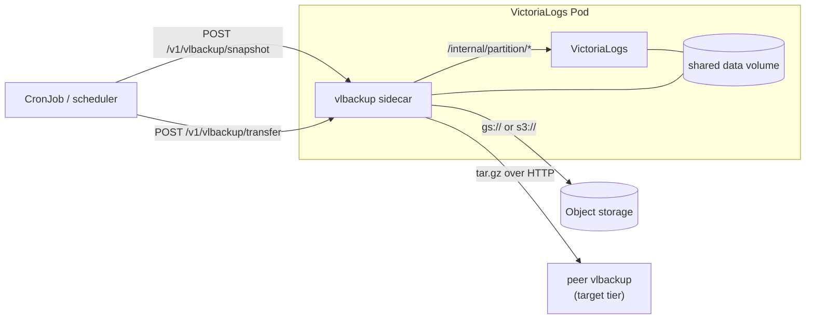

# VLBackup

**VLBackup** is a small Go sidecar for [VictoriaLogs](https://docs.victoriametrics.com/victorialogs/). It does two independent jobs:

- **Backup to object storage** — snapshot a VictoriaLogs partition and upload it as a `tar.gz` to Google Cloud Storage or any S3-compatible store.
- **Partition transfer** — move sealed daily partitions from one VictoriaLogs instance to another (a "two-tier" setup: fast/small → slow/large), sidecar-to-sidecar over HTTP.

Both are driven by a tiny HTTP API, so a Kubernetes `CronJob` (or any scheduler) can trigger them.

## Features

- Swappable object-storage backends — `gs://` (GCS) and `s3://` (AWS S3, MinIO, Ceph, R2, …), selected by the destination URL scheme.
- Streams snapshots as `tar.gz` directly to storage; no staging to local disk.
- Peer-to-peer partition transfer with conflict detection and crash recovery.
- Prometheus metrics and health/readiness probes on a separate ops port (`:9090`).
- Distroless multi-arch container image (`linux/amd64`, `linux/arm64`).

## Architecture

VLBackup runs as a sidecar next to VictoriaLogs, sharing its data volume so it can read snapshot files directly.

## Quick links

- :material-rocket-launch: **[Getting Started](user-guide/getting-started.md)** — run it locally and take your first snapshot
- :material-cog: **[Configuration](user-guide/configuration.md)** — CLI flags and environment variables
- :material-cloud-upload: **[Object Storage](user-guide/object-storage.md)** — `gs://` and `s3://` backends
- :material-api: **[HTTP API](reference/http-api.md)** — every endpoint with examples
- :material-code-json: **[API Explorer](reference/api-explorer.md)** — interactive OpenAPI schema
- :material-swap-horizontal: **[Partition Transfer](user-guide/partition-transfer.md)** — the two-tier mechanism
- :material-chart-line: **[Metrics](reference/metrics.md)** — Prometheus metrics reference
- :material-kubernetes: **[Deployment](reference/deployment.md)** — Helm sidecar and container image

