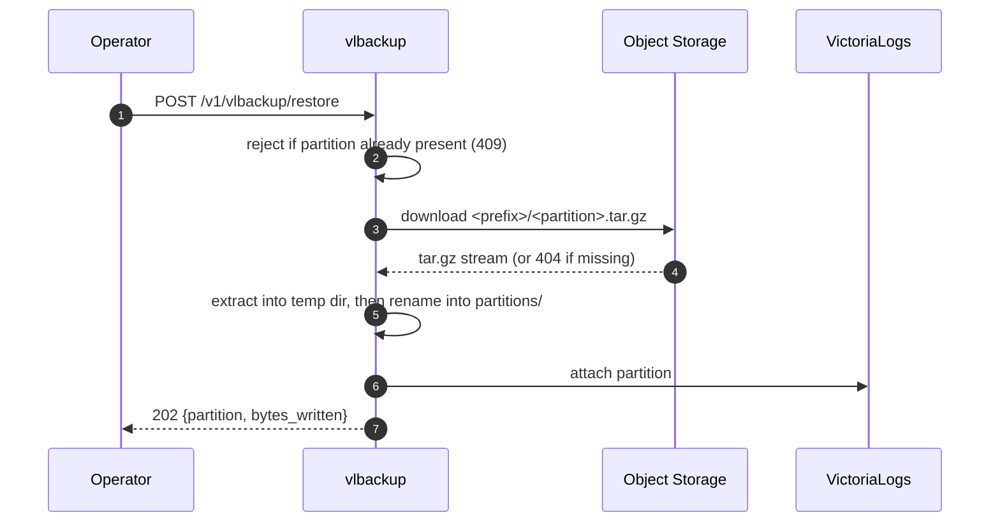

# Object Storage

The `POST /v1/vlbackup/snapshot` endpoint uploads each snapshot to an object store. The **destination URL scheme** selects the backend, the **URL host** is the bucket, and the **URL path** is used as a key prefix. Backends are configured entirely through environment variables.

```text
gs://my-bucket/some/prefix/     →  backend=gcs  bucket=my-bucket  prefix=some/prefix
s3://my-bucket/backups/         →  backend=s3   bucket=my-bucket  prefix=backups
```

Each snapshot is streamed as one `tar.gz` object named `<prefix>/<partition>.tar.gz` (for example `some/prefix/20260703.tar.gz`). Re-running a snapshot for the same partition **overwrites** the existing object.

## `gs://` — Google Cloud Storage

Uses [Application Default Credentials](https://cloud.google.com/docs/authentication/application-default-credentials) (ADC).

| Environment variable             | Description                                                                                                                                                                         |
| -------------------------------- | ----------------------------------------------------------------------------------------------------------------------------------------------------------------------------------- |
| `GOOGLE_APPLICATION_CREDENTIALS` | Path to a service-account key file. Omit it when using Workload Identity / metadata-server credentials.                                                                             |
| `STORAGE_EMULATOR_HOST`          | Optional `host:port` of a GCS emulator such as [fake-gcs-server](https://github.com/fsouza/fake-gcs-server). Honored natively by the SDK; used by the `example/compose.yaml` stack. |

```sh
curl -sL -XPOST http://localhost:8080/v1/vlbackup/snapshot \
  -H "Content-Type: application/json" \
  -d '{"destination_url": "gs://my-bucket/vlbackup/"}'
```

## `s3://` — AWS S3 and S3-compatible stores

Works with AWS S3, MinIO, Ceph RADOS Gateway, Cloudflare R2, Scaleway, and other S3-compatible endpoints.

| Environment variable    | Default            | Description                                                             |
| ----------------------- | ------------------ | ----------------------------------------------------------------------- |
| `AWS_ACCESS_KEY_ID`     | —                  | Access key.                                                             |
| `AWS_SECRET_ACCESS_KEY` | —                  | Secret key.                                                             |
| `AWS_SESSION_TOKEN`     | —                  | Optional session token for temporary credentials.                       |
| `AWS_REGION`            | *(auto)*           | Region; auto-detected when unset.                                       |
| `S3_ENDPOINT`           | `s3.amazonaws.com` | Endpoint `host[:port]`. Point this at MinIO/Ceph/R2 for non-AWS stores. |
| `S3_USE_SSL`            | `true`             | Whether to use TLS. Set `false` for a plaintext local MinIO.            |

```sh
curl -sL -XPOST http://localhost:8080/v1/vlbackup/snapshot \
  -H "Content-Type: application/json" \
  -d '{"destination_url": "s3://my-bucket/backups/"}'
```

!!! tip "MinIO / self-hosted endpoints"
    The client uses automatic bucket lookup: virtual-host style for `*.amazonaws.com`, path style for everything else — which is what MinIO and most self-hosted gateways expect. No extra configuration is needed.

## Restoring a partition

`POST /v1/vlbackup/restore` is the inverse of snapshot: it pulls one partition back out of object storage and attaches it to VictoriaLogs. The `source_url` uses the **same scheme/bucket/prefix model** as `destination_url` above, so a partition uploaded to `gs://my-bucket/vlbackup/` is restored from the same URL.

The object key is resolved as `<prefix>/<partition>.tar.gz` — exactly the name snapshot wrote — from the `partition_prefix` (`YYYYMMDD`) in the request:

```sh
curl -sL -XPOST http://localhost:8080/v1/vlbackup/restore \
  -H "Content-Type: application/json" \
  -d '{"source_url": "gs://my-bucket/vlbackup/", "partition_prefix": "20260703"}'
```

### Flow



The download is streamed into a **hidden temp dir on the same filesystem, then atomically renamed** into `<data-path>/partitions/<partition>/` — VictoriaLogs never sees a half-written partition. A failed extraction leaves nothing behind.

### Conflicts and errors

- **Partition already attached locally** → `409 Conflict`. Restore refuses to overwrite a live partition; it checks before spending the download. Detach/remove it first if you really mean to replace it.
- **Snapshot missing in object storage** → `404 Not Found` (the key `<prefix>/<partition>.tar.gz` does not exist).
- **Unsupported `source_url` scheme or malformed body** → `400 Bad Request`.
- **Download, extraction, or attach failure** → `500 Internal Server Error`.

!!! warning "Data path must match VictoriaLogs"
    As with transfer, the sidecar writes partitions into `<data-path>/partitions/`, so `VLBACKUP_DATA_PATH` must equal VictoriaLogs' `-storageDataPath`. VictoriaLogs must also expose `/internal/partition/attach`.

See the [HTTP API](../reference/http-api.md#post-v1vlbackuprestore) for the full request/response contract.

## Adding another backend

Support for a new store (Azure Blob, Backblaze B2, …) is a single new file in `pkg/objstore`. See [Architecture → Extending storage backends](../developer/architecture.md#extending-storage-backends) in the Developer guide.
