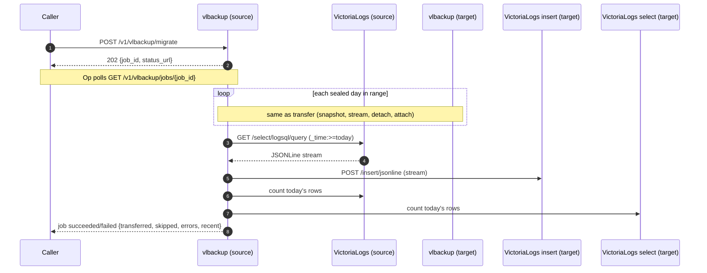

# Partition Migrate

The migrate endpoint is a superset of [transfer](partition-transfer.md): it moves **sealed daily partitions** the same way, and additionally copies **today's still-open data**. Use it when you want a target instance to end up with both the sealed history *and* the current day — for example when decommissioning an instance or standing up a replica.

Like transfer, this path does **not** touch object storage.

## Flow

For each sealed day in the range, migrate behaves exactly like [transfer](partition-transfer.md#flow) (snapshot → stream `tar.gz` → detach → attach). Today's partition cannot be snapshotted safely because it is still open, so migrate instead **queries** it out of the source VictoriaLogs over LogsQL as streamed JSONLine and **ingests** it into the target's JSON stream API.



## Request

`MigrateRequest` mirrors the transfer body but carries the three target URLs so the source can reach the target's vlbackup, insert, and select APIs directly:

| Field | Required | Purpose |
| --- | --- | --- |
| `target_vlbackup_url` | yes | Target vlbackup sidecar — moves sealed partitions (receive/attach). |
| `target_vlinsert_url` | yes | Target VictoriaLogs insert API — receives today's JSONLine data. |
| `target_vlselect_url` | yes | Target VictoriaLogs select API — used only to verify ingested row counts. |
| `target_vl_auth_key` | no | Optional VictoriaLogs `authKey` for the target insert/select calls. |
| `range` | yes | Sealed-day range, same semantics as transfer. |

The source of the recent-data query is always the **local** VictoriaLogs (`VLBACKUP_VICTORIA_LOGS_URL`).

## Range and recent-data semantics

- Sealed days follow the [same range rules as transfer](partition-transfer.md#range-semantics): UTC days `[from, to)`, today excluded, moved (detached from source).
- **Today's data** (`[today 00:00 UTC, now]`) is queried with `_time:>=<today>` and **copied** — the source keeps it. It is *not* deleted, detached, or de-duplicated.

!!! warning "Recent-data ingestion is at-least-once"
    VictoriaLogs does **not** deduplicate on ingest. Because today's partition is still receiving writes, migrate copies a moving target, and **re-running migrate re-inserts today's rows** on the target. Run it once per target, or expect duplicated rows for the current day. Sealed days are unaffected (they are moved with 409-conflict skipping, exactly like transfer).

## Response

Migration runs as a background job (`202` + `{job_id, status_url}`, same as
[transfer](partition-transfer.md)); poll the job status. Its `migrate` field is
the transfer response plus a `recent` object:

```json
{
  "transferred": ["20240113", "20240114"],
  "skipped": ["20240112"],
  "errors": [],
  "recent": {
    "partition": "20240115",
    "bytes_ingested": 4194304,
    "source_count": 1024,
    "target_count": 1024,
    "verified": true
  }
}
```

`verified` is `true` when the target's row count for today is at least the source's. It is an **advisory** check: a `false` value does not fail the job (freshly ingested rows may not be queryable on the target yet, and copying is at-least-once). A genuine failure — a query, ingest, or count call erroring out — lands in `errors` and marks the job `failed`. Sealed-day errors are reported exactly as in transfer.

## Deployment requirements

All the [transfer requirements](partition-transfer.md#deployment-requirements) apply for the sealed-day portion (shared data path, `/internal/partition/*` endpoints, shared `VLBACKUP_TRANSFER_AUTH_KEY`). Additionally, for the recent-data copy:

- The source's local VictoriaLogs must expose `/select/logsql/query`.
- The target's VictoriaLogs must expose `/insert/jsonline` and `/select/logsql/query`, reachable at `target_vlinsert_url` / `target_vlselect_url`.

See the [HTTP API](../reference/http-api.md#post-v1vlbackupmigrate) for the request/response contract.
