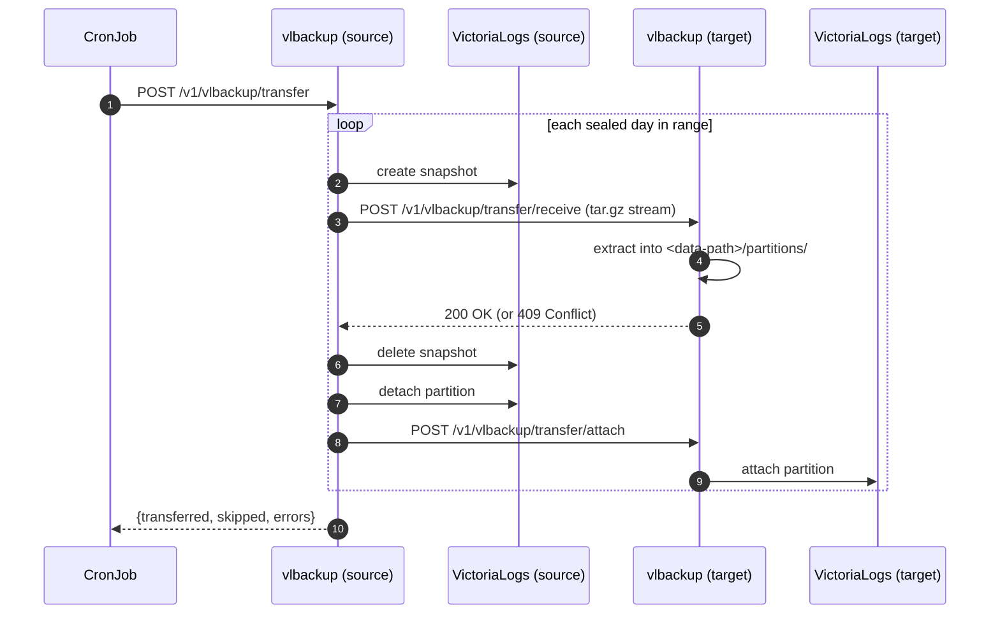

# Partition Transfer

The transfer endpoint moves **sealed daily partitions** from one VictoriaLogs instance to another, sidecar-to-sidecar over HTTP. It is designed for a **two-tier storage** setup: a fast/small "hot" instance keeps recent days, and a CronJob periodically pushes older sealed partitions to a slow/large "cold" instance.

This path does **not** touch object storage — it streams partition data directly between the two vlbackup sidecars.

## Flow

For each eligible day, the source snapshots the partition, streams it as `tar.gz` to the target, deletes its own snapshot, detaches the partition locally, then asks the target to attach it.



## Range semantics

- `range.from` is required; `range.to` is optional and defaults to now.
- Each bound is a time expression `<anchor>[+-<duration>][/<rounding>]` — `anchor` is `now` or an RFC3339 date, followed by optional `<int><unit>` math and an optional `/<unit>` that rounds down. Units: `y M w d h m s` (week starts Monday), evaluated in UTC. E.g. `now-7d/d`, `now/d`, `2026-07-01T00:00:00Z`.
- The range is interpreted as UTC days `[from, to)`.
- **Today's (active) partition is never transferred** — only sealed days strictly before today UTC are eligible.

## Conflict handling

If a partition already exists on the target, that day is **skipped**: the target returns `409 Conflict`, the source leaves its own data untouched, and the transfer continues with the next day. The day appears in the `skipped` list of the response.

Any other error aborts the remaining days and is reported in `errors` with a `500` status.

## Crash recovery

The risky window is between **detach** (source) and **attach** (target). If the source dies there, the partition data is already on the target but not attached. Re-attach it manually:

```sh
curl -XPOST -H "Authorization: Bearer $TOKEN" \
  "http://vlbackup-target:8080/v1/vlbackup/transfer/attach?partition=20260702"
```

## Deployment requirements

!!! warning "Both sidecars must share the VictoriaLogs data path"
    Each vlbackup sidecar must mount its VictoriaLogs data volume **at the same path as VictoriaLogs itself** (`-storageDataPath`, default `/data`, configured via `VLBACKUP_DATA_PATH`). The source reads snapshot files at the paths VictoriaLogs reports; the target writes partitions into `<data-path>/partitions/`.

- VictoriaLogs must expose the `/internal/partition/*` endpoints (snapshot create/delete, attach, detach).
- Set the same `VLBACKUP_TRANSFER_AUTH_KEY` on both sidecars so the target endpoints are authenticated.
- Trigger transfers from a Kubernetes `CronJob` (or any scheduler) hitting `POST /v1/vlbackup/transfer` on the source.

See the [HTTP API](../reference/http-api.md#post-v1vlbackuptransfer) for the request/response contract.
